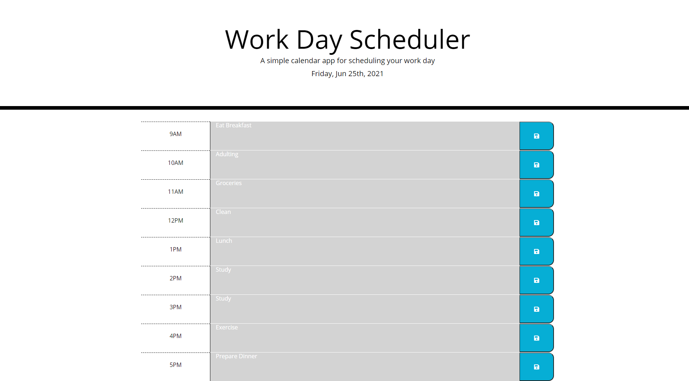

# Work Day Scheduler

This web application presents a day planner in which a user can create plans for each business hour and save them.

## Functionality 

```md
Current day is displayed at top of webpage
Timeblocks are presented for standard business hours
Each timeblock is color coded indicating if it's in the past, present or future
Timeblocks are editable to add planned events
Clicking the save button saves the respectful event to local storage
All added text is saved even after browser is closed
```

## Additional Info



Deployed [Work Day Scheduler](https://gaitherdb.github.io/Work-Day-Scheduler/) site on Github.

This application makes use of Bootstrap's CSS, FontAwesome's save icon, Google Font's Open Sans font, Moment.js' library to work with date & time, and jQuery's library for querying the HTML & CSS in Javascript. 

**Version 1.0**